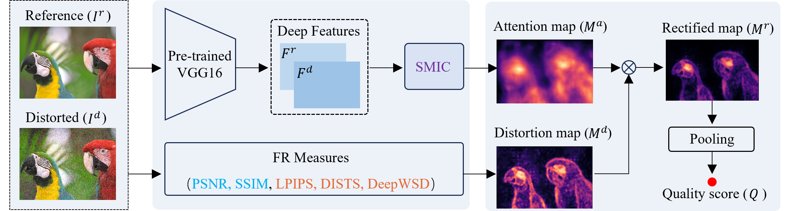
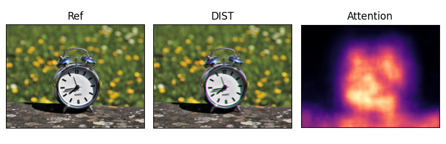

# SMIC

Code for "Sliced Maximal Information Coefficient: A Training-Free Approach for Image Quality Assessment Enhancement"



# Environment

The code has been tested on Linux systems with python 3.8. Please refer to requirements.txt for installing dependent packages.

```
pip install -r requirements.txt
```

# Running

- Enhanced FR-IQA models

  - The SMIC-based weighting scheme is integrated into five FR-IQA methods, including classical metrics (PSNR and SSIM) and learning-based methods (LPIPS, DISTS, DeepWSD).

  - The model corresponding to the enhanced version can be obtained in the [smic-pytorch](https://github.com/KANGX99/SMIC/tree/main/smic-pytorch) folder.

- Generate attention maps by SMIC

  `python SMIC_Map.py`

  

